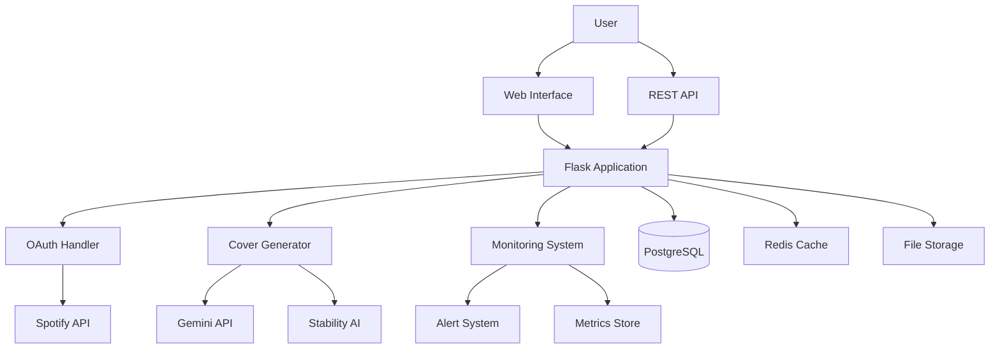
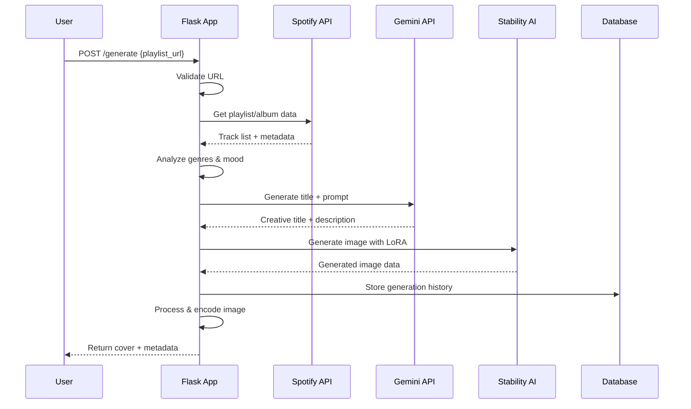
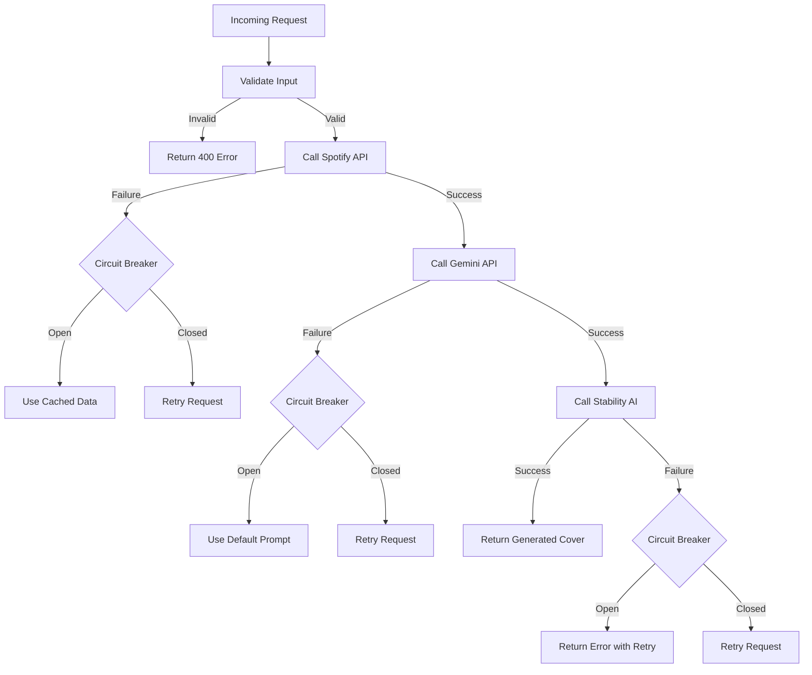
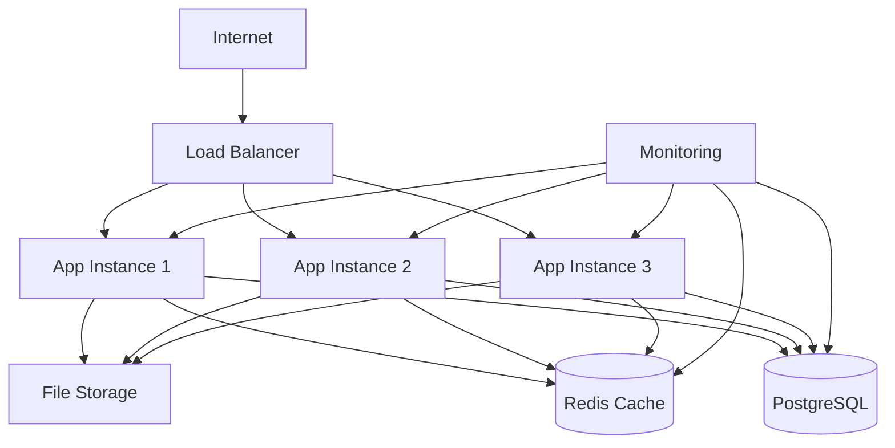

# Spotify Cover Generator - System Architecture

## Overview
The Spotify Cover Generator is a Flask-based web application that creates AI-generated album covers based on Spotify playlist or album data. The system integrates multiple AI services and provides a robust, scalable architecture for music-driven image generation.

## High-Level Architecture



## Core Components

### 1. Web Application Layer
- **Application Factory:** `__init__.py` (primarily via `factory.py`)
- **Main Application Runner:** `app.py` (uses the factory to create and run the app)
- **Configuration:** `config.py` (loaded by the factory)
- **Blueprints (for route handling):**
    - `main/` (core app routes, error handlers)
    - `auth/` (authentication, user profile routes)
    - `spotify_routes/` (Spotify API interactions, LoRA management)
- **Extensions:** `extensions.py` (SQLAlchemy, Migrate, Limiter instances)
- **Database Models:** `models.py`
- **Custom Decorators:** `decorators.py`
- **Authentication Utilities:** `auth_utils.py`
- **Framework:** Flask with Jinja2 templating
- **Purpose:** Orchestrates application creation, configuration, and request handling through a modular structure.
- **Key Features:**
  - Request routing and validation (via Blueprints)
  - Error handling and logging (centralized or in Blueprints)
  - Session management
  - Response formatting

### 2. Authentication & Authorization
- **Primary Logic:** `auth/` blueprint (routes), `auth_utils.py` (user fetching), `decorators.py` (access control decorators like `@login_required`).
- **Method:** Spotify OAuth 2.0 PKCE flow
- **Purpose:** Secure access to Spotify user data
- **Implementation:**
  - Authorization code with PKCE
  - Token refresh handling
  - Scope management (`playlist-read-private`, `playlist-read-collaborative`)

### 3. Cover Generation Engine
**File:** `generator.py`
- **Purpose:** Orchestrates the entire cover generation process
- **Workflow:**
  1. Playlist/album analysis via Spotify API
  2. Genre extraction and mood analysis
  3. AI prompt generation via Gemini
  4. Image generation via Stability AI
  5. Post-processing and optimization

**Key Functions:**
```python
def generate_cover(playlist_url, mood=None, custom_prompt=None, lora_model=None)
def analyze_playlist_genres(tracks)
def generate_title_with_gemini(genre_analysis, mood)
def create_image_with_stability(prompt, lora_settings)
```

### 4. Data Models
**File:** `models.py` (SQLAlchemy models defined here)
- **ORM:** SQLAlchemy
- **Purpose:** Data structure definitions and database interactions

**Models:**
- `GenreAnalysis`: Genre distribution and mood analysis
- `PlaylistData`: Spotify playlist/album metadata
- `LoraModel`: LoRA model configuration and metadata
- `GenerationHistory`: Audit trail of generated covers

### 5. External API Clients

#### Spotify Client (`spotify_client.py`)
- **SDK:** Spotipy (Spotify Web API wrapper)
- **Features:**
  - Playlist/album metadata retrieval
  - Track analysis and audio features
  - Artist and genre information
  - Rate limiting and error handling

#### AI Services Integration
- **Gemini API:** Creative title and prompt generation
- **Stability AI:** High-quality image generation with LoRA support
- **Circuit Breaker Pattern:** Fault tolerance for external API failures

### 6. Monitoring & Observability
**File:** `monitoring_system.py` (if custom logic) or integrated via Flask extensions.
- **Purpose:** Application health monitoring and performance tracking
- **Components:**
  - Health check system
  - Performance metrics collection
  - Alert management
  - System resource monitoring

**Metrics Tracked:**
- Request latency and throughput
- Error rates by component
- External API response times
- Resource utilization (CPU, memory, disk)
- Cache hit/miss ratios

### 7. Fault Handling
**File:** `fault_handling.py` (if custom logic) or integrated via Flask extensions/patterns.
- **Pattern:** Circuit Breaker with fallback strategies
- **Features:**
  - Automatic failure detection
  - Graceful degradation
  - Retry mechanisms with exponential backoff
  - Health-based traffic routing

## Data Flow

### Cover Generation Process


### Error Handling Flow


## Database Schema

### Tables
```sql
-- Generation history and audit trail
CREATE TABLE generation_history (
    id SERIAL PRIMARY KEY,
    playlist_url VARCHAR(255) NOT NULL,
    generated_title VARCHAR(255),
    genres JSONB,
    mood VARCHAR(50),
    lora_model VARCHAR(100),
    image_path VARCHAR(255),
    generation_time FLOAT,
    created_at TIMESTAMP DEFAULT CURRENT_TIMESTAMP,
    user_ip INET,
    success BOOLEAN DEFAULT TRUE,
    error_message TEXT
);

-- LoRA model configurations
CREATE TABLE lora_models (
    id SERIAL PRIMARY KEY,
    name VARCHAR(100) UNIQUE NOT NULL,
    source_type VARCHAR(20) NOT NULL, -- 'local' or 'link'
    path TEXT NOT NULL,
    trigger_words JSONB,
    description TEXT,
    is_active BOOLEAN DEFAULT TRUE,
    created_at TIMESTAMP DEFAULT CURRENT_TIMESTAMP
);

-- System metrics for monitoring
CREATE TABLE system_metrics (
    id SERIAL PRIMARY KEY,
    metric_name VARCHAR(100) NOT NULL,
    metric_value FLOAT NOT NULL,
    recorded_at TIMESTAMP DEFAULT CURRENT_TIMESTAMP,
    tags JSONB
);
```

### Indexes
```sql
CREATE INDEX idx_generation_history_created_at ON generation_history(created_at);
CREATE INDEX idx_generation_history_playlist_url ON generation_history(playlist_url);
CREATE INDEX idx_lora_models_active ON lora_models(is_active) WHERE is_active = TRUE;
CREATE INDEX idx_system_metrics_name_time ON system_metrics(metric_name, recorded_at);
```

## Security Architecture

### Authentication Security
- **OAuth 2.0 PKCE:** Prevents authorization code interception
- **Token Management:** Secure storage and automatic refresh
- **Scope Limitation:** Minimal required permissions

### API Security
- **Rate Limiting:** Prevent abuse and ensure fair usage
- **Input Validation:** Comprehensive validation of all inputs
- **CORS Configuration:** Controlled cross-origin access
- **Security Headers:** HSTS, CSP, and other security headers

### Data Protection
- **Environment Variables:** Sensitive data in environment variables
- **Database Encryption:** Encrypted at rest (PostgreSQL)
- **Secure Communication:** HTTPS/TLS for all external communications

## Performance Considerations

### Caching Strategy
- **Redis Cache:** Frequently accessed Spotify data
- **Browser Cache:** Static assets and generated images
- **Application Cache:** LoRA model metadata and configurations

### Optimization Techniques
- **Lazy Loading:** Load LoRA models on demand
- **Background Processing:** Async image generation for large requests
- **Connection Pooling:** Efficient database connection management
- **Image Compression:** Optimized image formats and sizes

### Scaling Considerations
- **Horizontal Scaling:** Stateless application design
- **Database Optimization:** Query optimization and indexing
- **CDN Integration:** Static asset delivery
- **Load Balancing:** Traffic distribution across instances

## Deployment Architecture

### Production Environment


### Infrastructure Components
- **Application Servers:** Multiple Flask instances behind load balancer
- **Database:** PostgreSQL with read replicas for scaling
- **Cache Layer:** Redis for session storage and caching
- **File Storage:** Persistent storage for generated images and LoRA models
- **Monitoring:** Comprehensive monitoring and alerting system

## Development Environment

### Local Setup
```bash
# Database
PostgreSQL (local instance or Docker)

# Cache
Redis (local instance or Docker)

# Python Environment
Python 3.9+
Virtual environment with requirements.txt

# Environment Variables
.env file with all required API keys and configurations
```

### Testing Strategy
- **Unit Tests:** Individual component testing
- **Integration Tests:** API endpoint testing
- **End-to-End Tests:** Complete workflow testing
- **Performance Tests:** Load testing for API endpoints

## API Integration Details

### External Dependencies
1. **Spotify Web API**
   - Rate Limits: 100 requests per minute
   - Authentication: OAuth 2.0
   - Fallback: Cached playlist data

2. **Google Gemini API**
   - Rate Limits: 60 requests per minute
   - Authentication: API Key
   - Fallback: Predefined prompt templates

3. **Stability AI**
   - Rate Limits: 10 requests per minute
   - Authentication: API Key
   - Fallback: Error message with retry suggestion

### Circuit Breaker Configuration
```python
circuit_breaker_config = {
    "failure_threshold": 5,
    "recovery_timeout": 30,
    "expected_exception": (RequestException, APIError)
}
```

## Future Architecture Considerations

### Planned Enhancements
1. **Microservices Migration:** Split into specialized services
2. **Event-Driven Architecture:** Async processing with message queues
3. **AI Model Hosting:** Self-hosted AI models for better control
4. **Multi-Region Deployment:** Global distribution for better performance
5. **Advanced Caching:** Intelligent caching with ML-based predictions